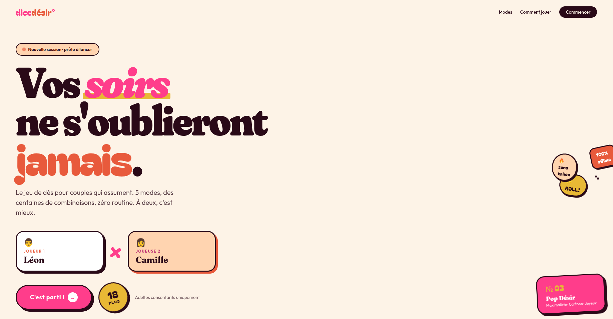

<div align="center">



# 🎲 Dice Désir

**PWA Next.js — jeu de dés coquins pour couples adultes (18+).**
100 % offline · installable · mobile-first · 18+

</div>

---

## ⚡ Quick start

```bash
npm install
npm run dev          # http://localhost:3000
npm run build        # production build
npm run start        # production server
```

## 📁 Structure

```
app/
  page.tsx                  Accueil (setup joueurs + 18+)
  modes/page.tsx            Sélection des 5 modes
  game/page.tsx             Jeu de dés (modes warm/sensual/hot/crescendo)
  kamasutra/page.tsx        Tirage de positions (mode kama)

components/
  theme/                    ThemeProvider + ThemeToggle (light=Pop Désir, dark=Néon Noir)
  ui/                       AppHeader, Pill, SettingsDrawer
  modes/ModeRow.tsx         Carte de mode dans la sélection
  dice/
    Dice.tsx                Wrapper smart : Dice3D si WebGL+use3D, sinon DiceCSS
    Dice3D.tsx              React Three Fiber, RoundedBoxGeometry, ombres soft
    DiceCSS.tsx             Fallback CSS preserve-3d
  kama/KamaCard.tsx         Carte Kamasutra avec image + stats
  game/Timer.tsx            Compte à rebours
  effects/EmojiRain.tsx     Pluie d'emojis au lancer

lib/
  types.ts                  Types TS (ModeId, Player, Action, Zone, Position…)
  store.ts                  Zustand + persist (localStorage)
  hooks.ts                  useVibrate, useMounted, useCountdown
  content/
    modes.ts                5 modes (warm, sensual, hot, kama, crescendo)
    actions.ts              Actions par niveau (warm/sensual/hot)
    zones.ts                Zones par niveau
    positions.ts            18 positions Kamasutra

scripts/
  gen-icons.mjs             Génère les icônes PWA depuis SVG (sharp)
  gen-kama-placeholders.mjs Génère 18 placeholders Kamasutra (à remplacer)

public/
  manifest.json             Manifest PWA
  icons/                    192/512/apple-touch + SVG source
  images/kama/              18 images de positions (placeholders, à remplacer)
```

## 🎨 Direction visuelle

- **Light = "Pop Désir"** : crème + hot pink + terracotta + moutarde, fonts Fraunces / Bagel Fat One / Outfit, néo-brutalist (gros traits noirs, ombres décalées)
- **Dark = "Néon Noir"** : noir + magenta néon + cyan, fonts Unbounded / JetBrains Mono, glow / cyberpunk
- Bascule via le toggle ☀️/🌙 ou détection système (`prefers-color-scheme`)

## 🎲 Dés

- **Dice3D** : React Three Fiber, vrai cube 3D avec textures CanvasTexture par face, ombres soft PCF, lazy-loaded (~150 ko)
- **DiceCSS** : fallback automatique si WebGL indisponible ou option désactivée dans Settings

## 🖼️ Images Kamasutra

Les 18 images dans `public/images/kama/` sont des **placeholders générés** (carrés colorés avec emoji + nom). Pour les remplacer par de vraies illustrations :

1. **Récupérer 18 illustrations** dans le style Pop Désir (cartoon contemporain, gros traits, couleurs vives) :
   - Pixabay : <https://pixabay.com/illustrations/search/cartoon%20love/> (gratuit, sans attribution)
   - PICRYL : <https://picryl.com/topics/kamasutra> (domaine public)
   - Midjourney/DALL·E avec prompt cohérent
   - Illustrateur Fiverr/Malt
2. **Renommer** en `01-lotus.jpg`, `02-missionary.jpg`, etc. (cf. `scripts/gen-kama-placeholders.mjs` pour la liste)
3. **Recommandé** : 800×600 JPG ou WebP optimisé < 80 ko chacune

## 📱 PWA

- Manifest, service worker (next-pwa), icônes 192/512/apple
- `display: standalone`, `theme_color` adapté light/dark
- Installation auto-prompt sur Chrome Android et iOS Safari
- 100% offline une fois la 1ère visite faite (toutes les routes/assets sont mis en cache)
- Désactivé en dev pour éviter le cache, actif en prod

## 🛠️ Stack

- Next.js 14 (App Router) + TypeScript
- Tailwind CSS 3 + tokens CSS variables sémantiques
- Framer Motion pour les transitions
- React Three Fiber + Drei pour les dés 3D
- Zustand + persist (localStorage) pour le state
- next-pwa pour le service worker

## 🔁 Régénérer les assets

```bash
node scripts/gen-icons.mjs              # icônes PWA
node scripts/gen-kama-placeholders.mjs  # 18 placeholders Kamasutra
```
